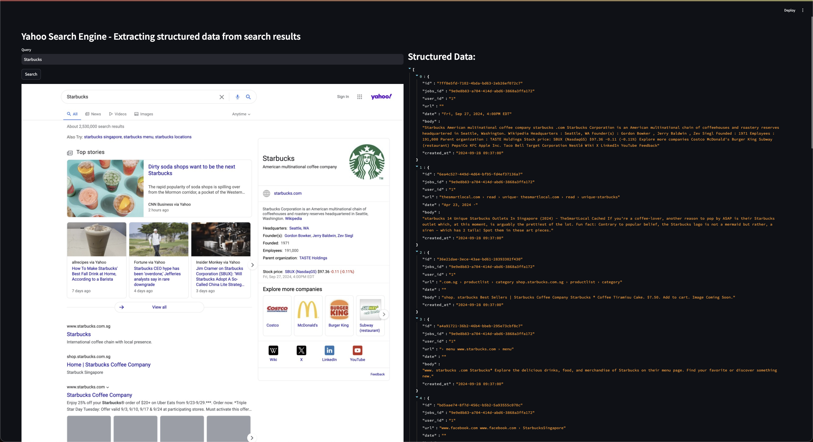

# RT ETL Pipeline for Extracting Structured Data from Yahoo Search HTML

## Objective:

Provides a robust web-server which extracts structured data from yahoo search results

As the process of extracting structured data is CPU intensive and slow

We propose an architecture which ingests these yahoo search results async

## Business Requirements

1. Provide an async API, allowing users to pass in a search term. They will be given a job id, to check the status of the extraction, and retrieve the results.

2. The async API should support high-throughput and real-time extraction in order of seconds.
- Users should be able to receive back the results in seconds
- The async server should be able to handle ~1,000+ concurrent connections

## Streamlit Demo:

(Refer to Step 10 under local Setup)



## High-Level Architecture


## Key Design Decisions

1. Async server as the front-desk.
- Responsible for receiving search term + creating a unique job id
- Saves search term + customer id + job id + status of job into Postgres
- Expose three endpoints
  - One to create a job
  - One to check status of job
  - One to get results of job
- Delegates extraction to consumer / producer process by producing to Kafka topic

2. Kafka Broker
- Contains two topic: `raw_search_terms` and `raw_search_results`
  - search_term: str
  - customer_id: str
  - job_id: str
  - created_at: datetime
- This topic will be ingested by the consumer / producer process

3. Yahoo Search Consumer / Producer
- Responsible for making an API call to yahoo search engine with the search term
- Saves the raw search results into Postgres
- Produces to `raw_search_results` topic
  - search_term: str
  - customer_id: str
  - job_id: str
  - search_result_id: id
  - created_at: datetime

4. Extractor Consumer / Producer
- Responsible for extracting the search result from postgres
- Extracts the structured data from the result
- Saves the structured data into postgres table
- Updates the job status to completed for the job_id

## Project Setup using Docker (Recommended)

### Step 1. Running Docker

```commandline
docker-compose up --build
```

### Step 2.
Enter localhost 8501 into your url to spin up the streamlit interactive app
```commandline
localhost:8501
```
#### OR
Using Insomnia or other API Clients:
(Refer to Local set up step 10)

## Project Setup Local

### Step 1. Setup env

Create your own .env file in the root directory and set the environment with:
(You may refer to the .env.example to set up your environment variables in a .env file)
```commandline
SERVER_URL=http://localhost:8000
ASYNC_POSTGRES_URL=postgresql+asyncpg://localhost:5432/yahoo_search_engine_rt
POSTGRES_URL=postgresql://localhost:5432/yahoo_search_engine_rt
KAFKA_BOOTSTRAP_SERVERS=localhost:9092
```

### Step 2. Setup Poetry
Then use poetry to install all the needed dependencies for this project.
```commandline
poetry shell
poetry install
```

### Step 3. Run Zookeeper Server
In a new terminal:
Navigate to kafka folder

```commandline
bin/zookeeper-server-start.sh ./config/zookeeper.properties
```

### Step 4. Run Kafka Server
In a new terminal:
```commandline
bin/kafka-server-start.sh ./config/server.properties
```

### Step 5. Create two Kafka Topics:
In a seperate terminal:
```
./create_topics.sh
```

Topic 1: `raw_search_terms`

```json
{
  "user_id": "123",
  "search_term": "Starbucks Coffee",
  "job_id": "123",
  "job_created_at": "2024-09-21 00:00:00"
}
```

Topic 2: `raw_search_results`

```json
{
  "user_id": "123",
  "search_term": "Starbucks Coffee",
  "job_id": "123",
  "job_created_at": "2024-09-21 00:00:00", 
  "raw_search_results_id": "1234",
  "raw_search_at": "2024-09-21 00:00:01"
}
```

### Step 6. Spin up postgresql@14
In a new terminal:
```commandline
brew services start postgresql@14
```

### Step 7. Spin up server
In a new terminal:
```commandline
export PYTHONPATH=.
python3 src/app.py
```

### Step 8. Run Yahoo Search Process
In a new terminal:
```commandline
python src/yahoo_search_process.py
```

### Step 9. Run Extractor Process
In a new terminal:
```commandline
export PYTHONPATH=.
python3 src/extractor_process.py
```

#### Check topic: `raw_search_terms`

```commandline
/Users/elsonchan/Desktop/kafka_2.13-3.7.1/bin/kafka-console-consumer.sh --bootstrap-server localhost:9092 --topic raw_search_terms --from-beginning

["{\"user_id\": \"1\", \"search_term\": \"Coffee Bean\", \"job_id\": \"f2dac9d8-d840-404d-b868-568a2615aa03\", \"job_created_at\": \"2024-09-21T08:28:49\"}"]
```

#### Check topic: `raw_search_results`

```commandline
/Users/elsonchan/Desktop/kafka_2.13-3.7.1/bin/kafka-console-consumer.sh --bootstrap-server localhost:9092 --topic raw_search_results --from-beginning

[{"user_id": "1", "search_term": "Gout", "job_id": "f59200ad-50dc-46c8-8287-2c85ac25e9b1", "job_created_at": "2024-09-22T09:43:41", "raw_search_results_id": "28e9741b-d51b-4076-8153-46e48febccf5", "raw_search_at": "2024-09-22T10:14:39"}, {"user_id": "1", "search_term": "Gout", "job_id": "1831cdc1-d555-4292-bf52-f6143ce0a9dd", "job_created_at": "2024-09-22T09:43:42", "raw_search_results_id": "7ebb9571-8e17-46f3-9082-ec32c96051d0", "raw_search_at": "2024-09-22T10:14:39"}, {"user_id": "1", "search_term": "Mala", "job_id": "da93d5f9-3ef8-4808-9d1e-b177a69e1bb5", "job_created_at": "2024-09-22T10:14:39", "raw_search_results_id": "1e7fc34d-9bc3-46a1-ab4d-c361b5cb259e", "raw_search_at": "2024-09-22T10:14:39"}]
[{"user_id": "1", "search_term": "Chicken Rice", "job_id": "7cd25644-9468-4b99-a60b-9ea25513eb1d", "job_created_at": "2024-09-22T10:14:56", "raw_search_results_id": "fadc5f38-fd6b-469a-8ced-91225cf97267", "raw_search_at": "2024-09-22T10:14:57"}]
```


### Step 10. Using Insomnia or other API Clients
#### Note: Skip to step 11 for interactive Frontend. Ensure to use the same job_id throughout.

POST http://localhost:8000/search

```json
{
	"search_term": "Chicken Rice",
	"user_id": "1"
}
```

Response

```
{
	"job_id": "7cd25644-9468-4b99-a60b-9ea25513eb1d",
	"search_term": "Chicken Rice"
}
```


#### GET command to `localhost:8000` with payload

GET http://localhost:8000/status
```json
{
	"job_id": "cbd44f3b-2a5c-47c6-a1e7-13abfaef9f3f"
}
```

Response
```
{
	"job_id": "cbd44f3b-2a5c-47c6-a1e7-13abfaef9f3f",
	"status": "COMPLETED"
}
```

#### GET command to `localhost:8000` with payload

GET http://localhost:8000/result
```json
{
	"job_id": "cbd44f3b-2a5c-47c6-a1e7-13abfaef9f3f"
}
```

Response
```
{
    "id": "bbff9221-f3de-4fce-9226-6ea6e2364191",
    "jobs_id": "cbd44f3b-2a5c-47c6-a1e7-13abfaef9f3f",
    "user_id": "1",
    "url": "SETHLUI.COM via Yahoo",
    "date": "",
    "body": "Top stories These Are The Copper Hair Trends Hairdressers Are Predicting For Autumn All The Copper Hair Inspo You Need For Autumn 2024Alessandro Zeno - LAUNCHMETRICS SPOTLIGHT Rust, bronze, strawberry blonde... whatever your chosen shade, copper hair is officially ... Elle via Yahoo 10 hours ago USA TODAY via Yahoo Dunkin' announces Halloween menu which includes Munchkins Bucket, other seasonal offerings 1 hour ago BBC via Yahoo Murder suspects remain in custody after body found 21 hours ago USA TODAY via Yahoo National Coffee Day 2024: Free coffee at Dunkin', Krispy Kreme plus more deals, specials 4 days ago China’s top snack giant set to debut 1st flagship outlet in Malaysia 7 hours ago USA TODAY via Yahoo Taco Bell testing new items: Caliente Cantina Chicken Burrito, Aguas Refrescas drink 6 days ago View all",
    "created_at": "2024-10-02 17:12:54"
}
```

### Step 11. Spin up Frontend (Streamlit app)
In a new terminal:
```commandline
export PYTHONPATH=.
streamlit run client/streamlit_app.py
```


### TODO:
- [x] Create Async front desk server, responsible for giving a job id to the client
- [x] Create alembic sqlalchemy tables
- [x] Added `/search` endpoint 
  - [x] to save a new record to `jobs` table
  - [x] Make main thread put a record to be produced, to `queue.Queue`
  - [x] Create background thread to listen to messages from a `queue.Queue`, to be produced to topic `raw_search_terms`
  - [x] Setup Kafka Cluster, create new topic `raw_search_terms`
- [x] Add first consumer / producer process. `yahoo_search_consumer_producer.py`
  - [x] Consumes from `raw_search_terms`
  - [x] Makes API call to yahoo search engine API
  - [x] Save results to `raw_search_results` table
  - [x] Produce message to `raw_search_results` topic
- [x] Add second consumer process. `extractor_consumer.py`
  - [x] Consumes from `raw_search_results` topic
  - [x] Use `raw_search_results_id` to query for full search results from `raw_search_results` PG table
  - [x] Extract
  - [x] Save results to `extracted_search_results` PG table
  - [x] Update SET `jobs` record's `job_status` to `JobStatus.COMPLETED`
- [x] Add Streamlit Prototype