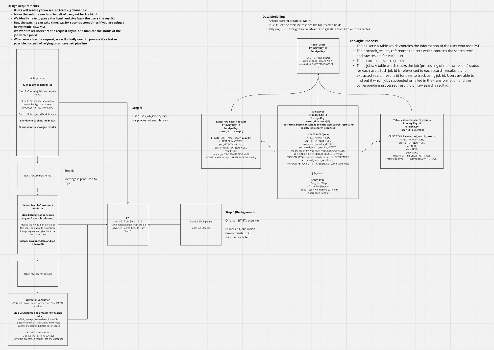

# RT ETL Pipeline for Extracting Structured Data from Yahoo Search HTML

## Objective:

Provides a robust web-server which extracts structured data from yahoo search results

As the process of extracting structured data is CPU intensive and slow

We propose an architecture which ingests these yahoo search results async

## Business Requirements

1. Provide an async API, allowing users to pass in a search term. They will be given a job id, to check the status of the extraction, and retrieve the results.

2. The async API should support high-throughput and real-time extraction in order of seconds.
- User should be able to receive back the results in seconds
- The async server should be able to handle ~1,000+ concurrent connections

## High-Level Architecture

## Key Design Decisions

1. Async server as the front-desk.
- Responsible for receiving search term + creating a unique job id
- Saves search term + customer id + job id + status of job into Postgres
- Expose three endpoints
  - One to create a job
  - One to check status of job
  - One to get results of job
- Delegates extraction to consumer / producer process by producing to Kafka topic

2. Kafka Broker
- Contains two topic: `raw_search_terms` and `raw_search_results`
  - search_term: str
  - customer_id: str
  - job_id: str
  - created_at: datetime
- This topic will be ingested by the consumer / producer process

3. Yahoo Search Consumer / Producer
- Responsible for making an API call to yahoo search engine with the search term
- Saves the raw search results into Postgres
- Produces to `raw_search_results` topic
  - search_term: str
  - customer_id: str
  - job_id: str
  - search_result_id: id
  - created_at: datetime

4. Extractor Consumer / Producer
- Responsible for extracting the search result from postgres
- Extracts the structured data from the result
- Saves the structured data into postgres table
- Updates the job status to completed for the job_id